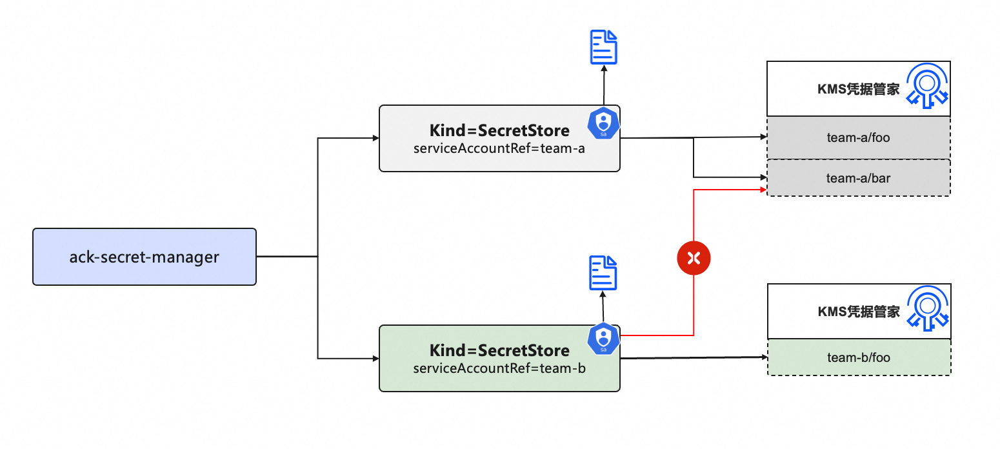

# serviceAccountRef Authentication: Fine-Grained RRSA Authorization at the ServiceAccount Level


## Background

In multi-tenant scenarios, users from different tenants want to bind distinct RAM roles to their respective namespace-scoped ServiceAccounts, and grant those roles permissions to access only specific credentials within KMS Secrets Manager that fall within their authorized scope.

ack-secret-manager supports the `serviceAccountRef` authentication method in SecretStore resources defined within tenant namespaces, enabling fine-grained control over KMS credential access permissions at the ServiceAccount level.




## Configuring Component Authentication

Achieve isolation of Secrets Manager access permissions across tenants by leveraging RRSA authorization based on distinct ServiceAccounts within each namespace.

RRSA is supported on ACK Managed Clusters running Kubernetes version 1.22 or higher. Compared to other authorization methods, RRSA enables pod-level permission isolation and eliminates the risk of credential leakage associated with directly using AccessKey IDs and secrets (AK/SK).

1. Enable the RRSA feature for your cluster in the [Container Service for Kubernetes (ACK) console](https://cs.console.aliyun.com/) to create the cluster's identity provider information. For detailed steps, see [Enable RRSA](https://www.alibabacloud.com/help/en/cs/user-guide/use-rrsa-to-configure-ram-permissions-for-serviceaccount-to-implement#section-ywl-59g-j8h).

2. Create a dedicated ServiceAccount in the specified namespace for accessing the designated KMS Secrets Manager secret. Note that the ServiceAccount must include the annotation `ack.alibabacloud.com/role-arn`, with its value set to the ARN of the target RAM role bound to this ServiceAccount.

```yaml
apiVersion: v1
kind: ServiceAccount
metadata:
  annotations:
    ack.alibabacloud.com/role-arn: acs:ram::<aliuid>:role/<role-name>
  name: <sa-name>
  namespace: <namespace>
```

3. Create a RAM role for each ServiceAccount. When creating the role, select `Identity Provider` as the Principal Type and configure the following key parameters. For detailed instructions, refer to the documentation on creating RAM roles for OIDC identity providers.

   | Configuration          | Description                                                  |
      | ---------------------- | ------------------------------------------------------------ |
   | Identity Provider Type | **OIDC**.                                                    |
   | Identity Provider      | Select `ack-rrsa-<cluster_id>`, where `<cluster_id>` is your cluster ID. |
   | Conditions             | - `oidc:iss`: Keep the default value. <br>- `oidc:aud`: Keep the default value. <br>- `oidc:sub`: You must manually add this condition.<br>　　- **Condition Key**: Select `oidc:sub`. <br>　　- **Operator**: Select `StringEquals`.<br>　　- **Condition Value**: Enter `system:serviceaccount:<namespace>:<serviceAccountName>`. <br>　　　　- `<namespace>` is the namespace of the designated ServiceAccount.<br>　　　　- `<serviceAccountName>` is the name of the ServiceAccount.<br><br>**Note**: The `namespace` and `serviceAccountName` here refer to the dedicated ServiceAccounts used by different tenants to access KMS Secrets Manager. |

4. Create a custom permission policy and attach it to the RAM role created in the previous step.
    - Create a custom policy granting the necessary permissions to retrieve KMS secrets. Example policy content is shown below. For detailed steps, see [Create custom polices](https://www.alibabacloud.com/help/en/ram/create-a-custom-policy).

   ```json
   {
    "Version": "1",
    "Statement": [
    {
      "Action": [
        "kms:GetSecretValue",
        "kms:Decrypt"
      ],
      "Resource": "acs:kms:<regionId>:<aliuid>:secret/xxxx",  # The specified KMS credential ARN
      "Effect": "Allow"
    }
    ]
   }
	```
    -  Grant permissions to the RAM role created in the previous step. For details, see [Grant permissions to a RAM role](https://www.alibabacloud.com/help/en/ram/user-guide/grant-permissions-to-a-ram-role).


5. Deploy the custom resource SecretStore using the `serviceAccountRef` authentication method.

- Create a file named `secretstore-rrsa.yaml` based on the template below, replacing the placeholder values accordingly:

    - `<name>`: Replace with your desired SecretStore instance name.
    - `<namespace>`: Replace with the target Kubernetes namespace.
    - `<sa-name>`: Replace with the ServiceAccount name created in [Step 2](https://www.alibabacloud.com/help/en/ack/ack-managed-and-ack-dedicated/security-and-compliance/use-ack-secret-manager-to-import-alibaba-cloud-kms-service-credentials#ddb7445031k1m).

```yaml
apiVersion: 'alibabacloud.com/v1alpha1'
kind: SecretStore
metadata:
  name: <name>
  namespace: <namespace>
spec:
  KMS:
    KMSAuth:
      serviceAccountRef:
        name: <sa-name>
```

- Deploy the SecretStore by running the following command:

  ```yaml
  kubectl apply -f secretstore-rrsa.yaml
  ```


## Deploy ExternalSecrets


- Create the namespaces `team-a` and `team-b` following the steps above, and create the corresponding ServiceAccount in each namespace.
- In the KMS Credentials Manager, create generic credential instances named `team-a` and `team-b` to simulate key instances for different users.
- Refer to the steps in the authentication configuration above to create RAM roles for different users, and set the `oidc:sub` condition in the trust policy principal to the corresponding ServiceAccount name in the Namespace. After creation, grant the RAM roles permissions to access the specified KMS credentials.
- Add an annotation to the ServiceAccounts in namespaces `team-a` and `team-b` with key `ack.alibabacloud.com/role-arn`, and set the value to the corresponding RAM role ARN.
- Create a SecretStore instance in namespaces `team-a` and `team-b`, and set the `serviceAccountRef` field to the ServiceAccount instance in the same namespace.
- Create ExternalSecret instances in namespaces `team-a` and `team-b` respectively, and use their own SecretStore to retrieve KMS credentials within their permission scope. Verify that Secret instances are successfully created in their respective namespaces.

```yaml
apiVersion: 'alibabacloud.com/v1alpha1'
kind: ExternalSecret
metadata:
  name: team-a
  namespace: team-a
spec:
  provider: kms
  data:
    - key: team-a
      name: test
      versionStage: ACSCurrent
      secretStoreRef:
        name: team-a
        namespace: team-a
---
apiVersion: 'alibabacloud.com/v1alpha1'
kind: ExternalSecret
metadata:
  name: team-b
  namespace: team-b
spec:
  provider: kms
  data:
    - key: team-b
      name: test
      versionStage: ACSCurrent
      secretStoreRef:
        name: team-b
        namespace: team-b
```


- Try using `team-b`'s SecretStore to access `team-a`'s KMS credentials.

  ```yaml
  
  apiVersion: 'alibabacloud.com/v1alpha1'
  kind: ExternalSecret
  metadata:
    name: team-b-bad
    namespace: team-b
  spec:
    provider: kms
    data:
      - key: team-a  #team-a credential
        name: test
        versionStage: ACSCurrent
        secretStoreRef:
          name: team-b
          namespace: team-b
  ```

- Run `kubectl get externalsecrets -nteam-b team-b-bad -oyaml` and check whether the `status` field of the `externalsecrets team-b-bad` instance contains a 403 error message:

  ```yaml
  client namespace/team-b/team-b get data error SDKError:
           StatusCode: 403
           Code: Forbidden.NoPermission
           Message: code: 403, This operation for acs:kms:cn-hangzhou:xxxxx:secret/team-a is forbidden by permission system. request id: ...
  ```

  


